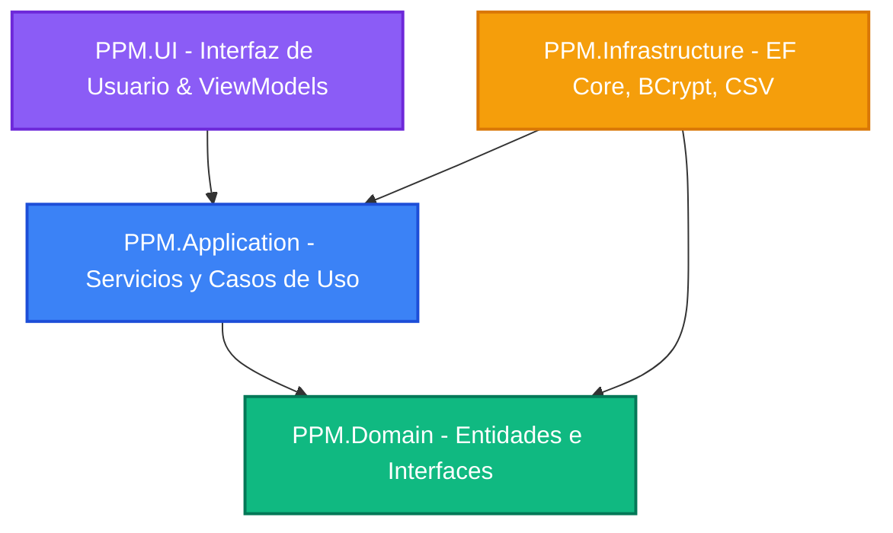
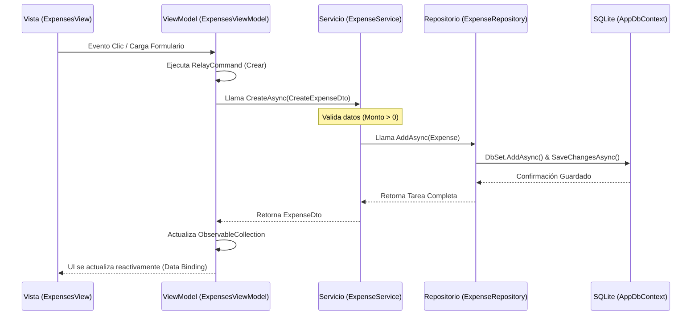
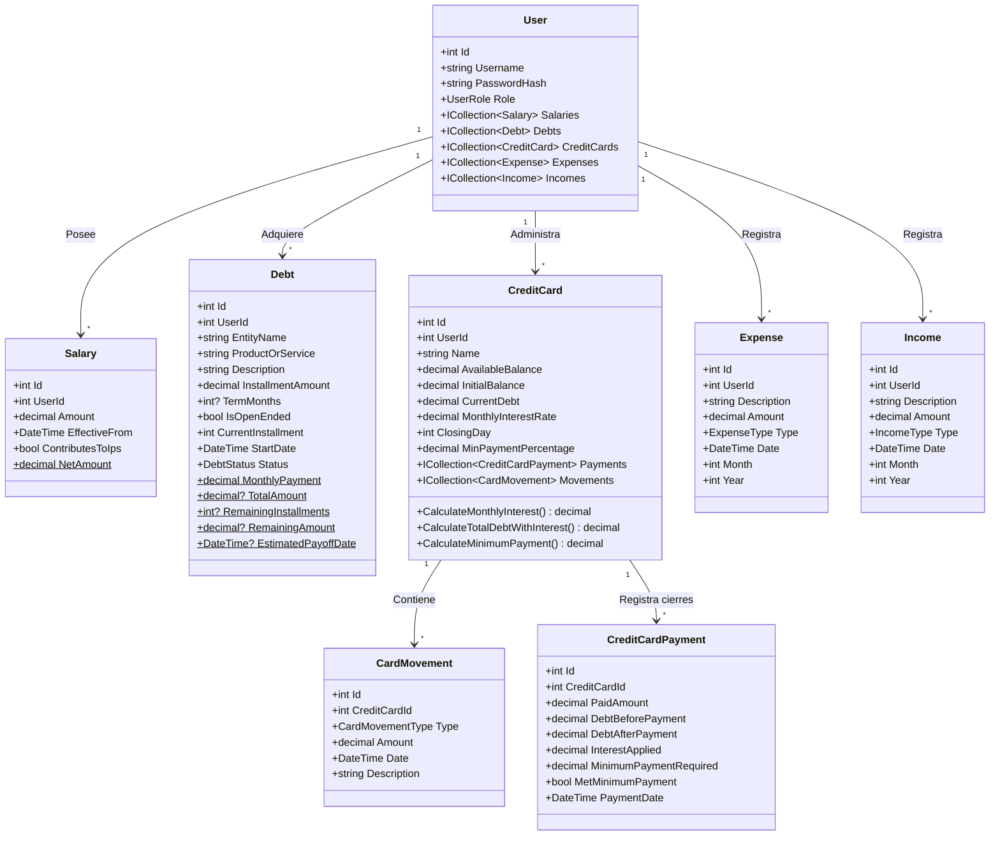
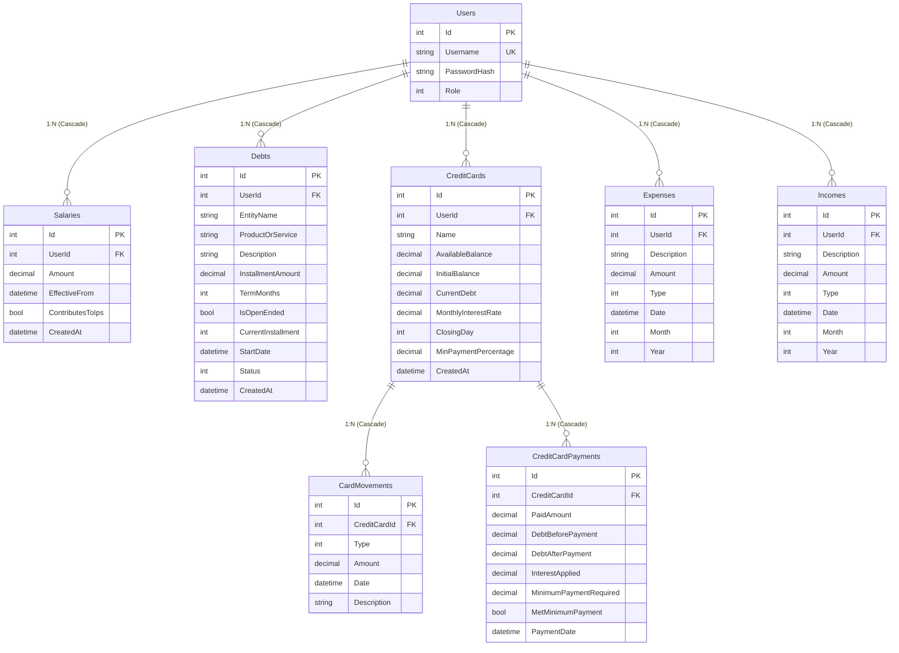
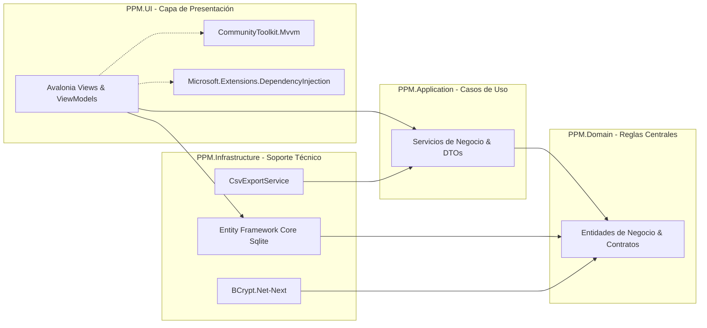

# Guía Técnica para la Defensa del Proyecto: PPM (Personal Process Manager)
**Materia:** Ingeniería de Software / Programación Orientada a Objetos  
**Universidad:** Universidad Autónoma de Asunción (UAA)  
**Proyecto:** PPM — Personal Process Manager (Gestor de Finanzas Personales Offline)  
**Integrantes:** Mauro Silvero, Francesco Paez, Wilson Ayala, Ana Gayoso, Marcos Bogado  

---

## Estructura de la Presentación y Contenido de las Diapositivas

---

### Diapositiva 1: Portada (Presentación del Proyecto)
* **Título:** PPM — Personal Process Manager
* **Subtítulo:** Sistema Multiplataforma de Gestión y Planificación de Finanzas Personales 100% Local
* **Objetivo de la diapositiva:** Presentar formalmente el proyecto, la institución, la materia y los integrantes del equipo de desarrollo, estableciendo un tono profesional y académico desde el inicio.
* **Contenido:**
  * **Nombre del Proyecto:** PPM (Personal Process Manager)
  * **Integrantes del Equipo:** Mauro Silvero, Francesco Paez, Wilson Ayala, Ana Gayoso, Marcos Bogado
  * **Materia:** Taller de Programación / Ingeniería de Software
  * **Universidad:** Universidad Autónoma de Asunción (UAA)
  * **Fecha:** Julio 2026
* **Explicación para exponer oralmente:**
  > "Buenas tardes, profesor y compañeros. Hoy venimos a presentar nuestro proyecto de fin de curso llamado **PPM (Personal Process Manager)**. Es una aplicación de escritorio multiplataforma diseñada para ayudar a las personas a tomar el control absoluto de sus finanzas personales de forma privada, segura y sin depender de servicios en la nube. A lo largo de esta presentación, detallaremos no solo qué hace la aplicación, sino cómo la hemos diseñado bajo estándares de Clean Architecture y las decisiones tecnológicas que tomamos para garantizar un software robusto, mantenible y escalable."
* **Notas del presentador:** Mantener contacto visual directo. Asegurar que los nombres de los integrantes aparezcan legibles. El título destaca "PPM", pero aclara inmediatamente que se trata de finanzas personales.
* **Sugerencias visuales:** Fondo oscuro elegante (Deep Slate #1E293B) con acentos en verde esmeralda (#10B981) para denotar finanzas. Logotipo minimalista con las letras P-P-M interconectadas.
* **Duración aproximada:** 1.5 minutos.
* **Expositor sugerido:** **Mauro Silvero** (Coordinador y apertura).

---

### Diapositiva 2: Introducción y Planteamiento del Problema
* **Título:** El Desafío de la Salud Financiera
* **Objetivo de la diapositiva:** Explicar el problema del descontrol financiero personal, la falta de privacidad en herramientas en la nube y cómo PPM responde a estas necesidades.
* **Contenido:**
  * **El Problema:** La falta de visibilidad del presupuesto real, la complejidad en el cálculo de deudas y tarjetas de crédito, y el recelo de los usuarios a subir sus datos financieros a servidores de terceros en internet.
  * **La Propuesta de PPM:** Un gestor financiero local, offline por diseño, donde el usuario tiene el control absoluto de su base de datos.
  * **Objetivo del Sistema:** Consolidar en una sola pantalla el salario neto (después de descuentos previsionales como el IPS), el saldo disponible real tras cubrir obligaciones fijas, el control de cuotas de deudas, y el libro diario de tarjetas de crédito con proyección de intereses y pagos mínimos.
* **Explicación para exponer oralmente:**
  > "La mayoría de las personas no sabe con exactitud cuánto dinero libre tiene a fin de mes. Tienen un salario, pero a este se le restan impuestos o aportes de jubilación (como el IPS en Paraguay), cuotas de deudas de plazo fijo o indefinido, y el pago mínimo de las tarjetas de crédito. Muchas aplicaciones en el mercado exigen una conexión a internet y suben datos sensibles a la nube, lo que ahuyenta a usuarios preocupados por su privacidad. PPM resuelve esto de raíz: funciona de manera 100% local y offline, consolidando toda la información financiera en un Dashboard inteligente que trabaja a partir del salario real neto del usuario."
* **Notas del presentador:** Enfatizar la palabra "Privacidad" y "Control Local". Esto justifica la arquitectura técnica offline seleccionada.
* **Sugerencias visuales:** Iconografía que represente un candado (privacidad), un gráfico financiero y una base de datos local. Usar contraste de colores para destacar "Nube (Peligro/Riesgo)" vs. "Local (Seguridad/Privacidad)".
* **Duración aproximada:** 2 minutos.
* **Expositor sugerido:** **Mauro Silvero**.

---

### Diapositiva 3: Tecnologías Utilizadas y Justificación
* **Título:** Stack Tecnológico: ¿Por qué elegimos estas herramientas?
* **Objetivo de la diapositiva:** Describir y justificar el conjunto de tecnologías utilizadas, demostrando que cada elección responde a criterios de arquitectura y diseño multiplataforma local.
* **Contenido:**
  * **Lenguaje:** **C# 12.0** (Tipado estático fuerte, sintaxis moderna como *primary constructors* y expresiones de colección).
  * **Framework Base:** **.NET 8.0 LTS** (Plataforma de alto rendimiento, multiplataforma y con soporte a largo plazo).
  * **Interfaz Gráfica:** **Avalonia UI 11.3.10** (Framework XAML multiplataforma moderno. Reemplaza a WinForms/WPF, permitiendo ejecutar el mismo código en Windows, macOS y Linux con renderizado nativo de alto rendimiento).
  * **Capa MVVM:** **CommunityToolkit.Mvvm 8.4.2** (Generadores de código C# para eliminar código repetitivo, simplificando la reactividad en la UI).
  * **Acceso a Datos (ORM):** **Entity Framework Core 8.0.11** (Para un mapeo robusto objeto-relacional y migraciones automáticas).
  * **Base de Datos:** **SQLite** (Motor embebido local, sin necesidad de instalar servidores de bases de datos externos).
  * **Seguridad:** **BCrypt.Net-Next 4.0.3** (Cifrado adaptativo unidireccional de contraseñas).
* **Explicación para exponer oralmente:**
  > "Para construir PPM no recurrimos a tecnologías tradicionales como Windows Forms, que nos encadenarían a Windows. En su lugar, optamos por **Avalonia UI** combinado con **.NET 8**, lo que nos permite compilar un único ejecutable nativo para Windows, Linux o macOS. En la persistencia de datos elegimos **Entity Framework Core** con **SQLite**. Esto significa que la base de datos se guarda en un único archivo físico local (`ppm.db`), eliminando la necesidad de que el usuario final instale un motor de base de datos pesado como SQL Server. Finalmente, la seguridad no se negoció: las contraseñas se almacenan hasheadas con **BCrypt**, garantizando que ni siquiera alguien con acceso físico a la base de datos pueda leer la contraseña del usuario."
* **Notas del presentador:** Estar listos para responder por qué no se usó WinForms (por ser obsoleto y limitado a Windows) o SQL Server (por requerir una infraestructura cliente-servidor innecesaria para una app monousuario local).
* **Sugerencias visuales:** Una tabla comparativa compacta con los logos oficiales de .NET, Avalonia UI, SQLite y Entity Framework.
* **Duración aproximada:** 2.5 minutos.
* **Expositor sugerido:** **Francesco Paez** (Introducción al desarrollo técnico).

---

### Diapositiva 4: Arquitectura General de la Aplicación
* **Título:** Arquitectura Limpia (Clean Architecture)
* **Objetivo de la diapositiva:** Mostrar el diseño arquitectónico del software basado en la separación de responsabilidades y la regla de dependencia hacia adentro.
* **Contenido:**
  * **Estructura en 4 Proyectos Decoplados:**
    1. **PPM.Domain (El Núcleo):** Entidades de negocio, enums, constantes y contratos (interfaces) de repositorios. Cero dependencias externas.
    2. **PPM.Application (Casos de Uso):** Lógica de negocio, servicios, DTOs de entrada y salida. Solo depende de `Domain`.
    3. **PPM.Infrastructure (Adaptadores externos):** Implementación de base de datos (EF Core, Migraciones), hasheo de contraseñas (BCrypt), exportación de archivos (CSV). Depende de `Application` y `Domain`.
    4. **PPM.UI (Presentación):** Vistas (AXAML), ViewModels (MVVM) y configuración de Inyección de Dependencias. Depende de `Application` e indirectamente de `Infrastructure` solo para el registro del contenedor en el arranque.
  * **Ley de Dependencia:** Las capas externas dependen de las internas. El núcleo (`Domain`) no conoce nada de bases de datos ni de interfaces de usuario.
* **Explicación para exponer oralmente:**
  > "El proyecto está estructurado siguiendo los principios de **Clean Architecture** (Arquitectura Limpia). Esto lo dividimos en cuatro proyectos C# claramente diferenciados. En el centro absoluto está **PPM.Domain**, donde viven las reglas del negocio puro, como las fórmulas de cálculo de intereses de tarjetas o el descuento del IPS. Esta capa es 100% pura y no depende de ninguna base de datos o librería de interfaz. En torno al dominio está **PPM.Application**, que define los servicios y casos de uso del sistema. Por fuera se sitúan **PPM.Infrastructure** y **PPM.UI**. Esta separación estricta nos permite, por ejemplo, cambiar mañana mismo la base de datos de SQLite a SQL Server, o cambiar la interfaz gráfica de Avalonia a una web de ASP.NET, modificando únicamente la capa externa y dejando intacta toda la lógica de negocio y las entidades."
* **Notas del presentador:** Usar el diagrama circular típico de Clean Architecture. Explicar cómo la inyección de dependencias nos ayuda a desacoplar las interfaces de su implementación real.
* **Sugerencias visuales:** Diagrama concéntrico de arquitectura limpia.

* **Duración aproximada:** 3 minutos.
* **Expositor sugerido:** **Francesco Paez**.

---

### Diapositiva 5: Árbol de Directorios del Código Fuente
* **Título:** Organización Física del Código (Estructura de la Solución)
* **Objetivo de la diapositiva:** Mostrar el árbol completo del código fuente (`src/`) y explicar la responsabilidad de cada directorio del sistema.
* **Contenido:**
  * **Estructura física del proyecto:**
```
src/
├── PPM.Domain/
│   ├── Constants/       # Constantes del negocio (e.g. IPS = 9%)
│   ├── Entities/        # Clases de dominio ricas (User, Salary, Debt, etc.)
│   ├── Enums/           # Enumeraciones (CardMovementType, DebtStatus, etc.)
│   ├── Exceptions/      # Excepciones de negocio personalizadas
│   └── Interfaces/      # Contratos de acceso a datos (IUserRepository, etc.)
├── PPM.Application/
│   ├── DTOs/            # Estructuras de datos planas para transferir información
│   └── Services/        # Lógica de aplicación y orquestación
├── PPM.Infrastructure/
│   ├── Data/            # DbContext de EF Core, configuraciones Fluent API
│   ├── Export/          # CsvExportService para reportes
│   ├── Migrations/      # Historial de cambios de base de datos
│   ├── Repositories/    # Implementaciones concretas de acceso a datos con EF
│   └── Security/        # Hasheador de contraseñas con BCrypt
└── PPM.UI/
    ├── Converters/      # Formateadores de UI (ej: formato de moneda Guaraní)
    ├── Services/        # Servicios visuales (FileDialogService)
    ├── ViewModels/      # Lógica de pantalla y enlace de datos (MVVM)
    └── Views/           # Declaración visual en XAML (AXAML)
```
* **Explicación para exponer oralmente:**
  > "Aquí podemos ver cómo se organiza físicamente el código de PPM en nuestro disco. Cada una de las carpetas responde a un propósito de diseño específico. En el dominio vemos que las entidades de negocio se separan de los contratos de persistencia. En la capa de aplicación, los servicios coordinan los flujos y se comunican con el exterior únicamente mediante **DTOs (Data Transfer Objects)**, evitando exponer las entidades del dominio directamente a la UI. En infraestructura agrupamos la implementación de EF Core y los repositorios, y en la UI se sigue el patrón MVVM estricto, separando los archivos `.axaml` (diseño visual en XAML) de sus correspondientes archivos `.cs` de lógica de presentación (ViewModels), enlazados dinámicamente mediante un `ViewLocator`."
* **Notas del presentador:** Resaltar la limpieza organizativa. Explicar que la carpeta `Migrations` es generada por Entity Framework Core y guarda el historial evolutivo del esquema de base de datos.
* **Sugerencias visuales:** Diagrama tipo árbol de carpetas con colores asociados a cada capa de arquitectura.
* **Duración aproximada:** 2.5 minutos.
* **Expositor sugerido:** **Wilson Ayala** (Manejo de estructura de datos).

---

### Diapositiva 6: Flujo Completo del Programa
* **Título:** Ciclo de Vida de una Acción del Usuario
* **Objetivo de la diapositiva:** Ilustrar paso a paso cómo viaja la información por toda la arquitectura cuando el usuario interactúa con la pantalla (ejemplo: registrar un gasto).
* **Contenido:**
  * **El camino de una solicitud:**
    1. **Entrada de usuario:** El usuario pulsa un botón o llena un formulario en la vista (ej. `ExpensesView`).
    2. **Enlace y Comando (MVVM):** La vista dispara un `RelayCommand` en el `ExpensesViewModel` con datos del formulario.
    3. **Invocación del Servicio:** El ViewModel invoca al servicio `IExpenseService` pasándole un DTO.
    4. **Validación de Reglas:** El servicio valida los datos del DTO (por ejemplo, que el monto sea mayor a 0).
    5. **Persistencia (Repositorio):** El servicio crea la entidad `Expense` y se la pasa al `IExpenseRepository`.
    6. **Guardado Físico:** El repositorio utiliza `AppDbContext` para registrar el cambio en SQLite y ejecuta `SaveChangesAsync`.
    7. **Respuesta y Flujo Inverso:** El flujo retorna confirmación, el ViewModel refresca la lista observable y la UI se actualiza reactivamente de forma automática.
* **Explicación para exponer oralmente:**
  > "Para entender el funcionamiento interno de la aplicación, es fundamental ver cómo fluyen los datos. Cuando un usuario carga un gasto, por ejemplo de 'Alimentación' por 50.000 Gs, interactúa con **ExpensesView**. Esta vista está vinculada a **ExpensesViewModel** mediante *data binding*. Al presionar 'Guardar', se ejecuta un comando asíncrono en el ViewModel. Este solicita al servicio **ExpenseService** que cree el gasto. El servicio se encarga de aplicar las reglas de negocio, validando que el monto no sea cero ni negativo. Si la validación pasa, crea un objeto de dominio de tipo **Expense** y llama al **ExpenseRepository**. El repositorio, utilizando Entity Framework Core, traduce este objeto en una sentencia SQL e inserta la fila en SQLite. Finalmente, la respuesta viaja de vuelta y la interfaz se redibuja automáticamente gracias al enlace de datos reactivo."
* **Notas del presentador:** Describir con confianza el diagrama de secuencia. Destacar el uso de operaciones asíncronas (`async/await`) en todo el ciclo, lo cual evita que la interfaz gráfica se congele mientras escribe en el disco.
* **Sugerencias visuales:** Diagrama de flujo horizontal.

* **Duración aproximada:** 3 minutos.
* **Expositor sugerido:** **Wilson Ayala**.

---

### Diapositiva 7: Relación entre Interfaz y Código (Vistas Clave)
* **Título:** Contenedores e Interfaz Dinámica
* **Objetivo de la diapositiva:** Explicar las vistas principales del sistema, cómo se comunican las pantallas entre sí y cómo se estructuran las vistas complejas.
* **Contenido:**
  * **MainWindow (El Anfitrión):** Contenedor principal que hospeda un control dinámico. A nivel de datos, enlaza su propiedad `CurrentPage` a un `ViewModelBase`.
  * **LoginView:** Pantalla inicial del sistema. Al validar las credenciales correctamente, dispara el evento `LoginSucceeded` hacia el `MainWindowViewModel`, el cual destruye el login y carga el Shell principal.
  * **ShellView (El Navegador):** Contiene el menú lateral y la lógica de navegación dinámica de pestañas. Al hacer clic en un módulo (Dashboard, Deudas, Tarjetas), carga dinámicamente el ViewModel correspondiente mediante inyección de dependencias.
  * **ViewLocator:** Mecanismo reflexivo de Avalonia que, de forma automática, busca una vista llamada `XxxView` cuando detecta un ViewModel `XxxViewModel`.
* **Explicación para exponer oralmente:**
  > "Una de las preguntas típicas en una defensa es: ¿cómo se comunican los formularios si no usamos variables globales? En PPM lo resolvimos de forma limpia mediante eventos y sustitución dinámica de contextos de datos. **MainWindow** es una ventana vacía con un espacio reservado. Inicialmente aloja a **LoginView**. Cuando el login es exitoso, la vista no abre otra ventana; en su lugar, el `LoginViewModel` dispara el evento `LoginSucceeded`. El `MainWindowViewModel` captura este evento, recibe el ID del usuario autenticado, y reemplaza la página actual por el **ShellView**. El ShellView maneja un menú lateral. Cuando el usuario hace clic en 'Deudas', el sistema pide al contenedor de dependencias el `DebtsViewModel` pasándole el ID del usuario, y el componente **ViewLocator** localiza la vista correspondiente y la renderiza en pantalla al instante."
* **Notas del presentador:** Esta diapositiva es crucial para demostrar el dominio técnico sobre Avalonia UI y la correcta implementación del patrón MVVM sin acoplar vistas directamente.
* **Sugerencias visuales:** Esquema simplificado de la MainWindow conteniendo sub-vistas intercambiables.
* **Duración aproximada:** 2.5 minutos.
* **Expositor sugerido:** **Ana Gayoso** (Especialista en Frontend/UI).

---

### Diapositiva 8: Explicación de los Módulos del Sistema
* **Título:** Módulos de Negocio en Acción
* **Objetivo de la diapositiva:** Describir la lógica de negocio implementada en cada módulo financiero de la aplicación.
* **Contenido:**
  * **Módulo de Salario:** Carga del salario bruto, cálculo del neto (descuento del 9% de IPS mediante constante parametrizada) e historial de vigencia de salarios.
  * **Módulo de Deudas:** Registro de deudas activas o canceladas, cuotas pagadas, y cálculo automático en memoria de saldo remanente y fecha estimada de finalización.
  * **Módulo de Tarjetas:** Libro diario de movimientos. Permite registrar consumos y pagos. El saldo disponible se recalcula sumando consumos y restando pagos sobre el saldo inicial. Admite procesos de "Cierre" aplicando tasas de interés parametrizables.
  * **Módulo de Gastos e Ingresos:** Clasificación por categorías con control de variaciones porcentuales comparando el mes actual con el mes anterior.
  * **Módulo de Exportación:** Motor de exportación a CSV para análisis externo en Excel.
* **Explicación para exponer oralmente:**
  > "PPM está compuesto por 5 módulos de finanzas personales fuertemente integrados. En el **Salario** definimos los ingresos base y si aplican aportes previsionales. En **Deudas** gestionamos obligaciones financieras a plazo fijo o variable. El módulo de **Tarjetas de Crédito** es muy interesante: no registra deudas estáticas, sino que funciona como un libro diario contable de consumos y pagos. Cuando ocurre el cierre mensual, el sistema evalúa si quedó saldo pendiente y, de ser así, aplica los intereses sobre la deuda no saldada y calcula el pago mínimo exigible. Los gastos e ingresos extras alimentan un balance mensual dinámico, y con un solo clic en el Dashboard, el usuario puede exportar todo su histórico en un archivo CSV formateado para Excel."
* **Notas del presentador:** Comentar que el sistema maneja la moneda de manera interna como números enteros, ya que en Guaraníes no se utilizan centavos. Esto evita errores de redondeo float.
* **Sugerencias visuales:** Iconos elegantes representativos de cada módulo en un diseño tipo panel.
* **Duración aproximada:** 3 minutos.
* **Expositor sugerido:** **Ana Gayoso**.

---

### Diapositiva 9: Explicación de Código Crítico: Persistencia y Lógica de Negocio
* **Título:** Análisis de Código: Recálculo de Saldo de Tarjetas
* **Objetivo de la diapositiva:** Demostrar rigor técnico analizando una sección crucial del código: el recálculo contable de saldos de tarjetas y la aplicación de intereses.
* **Contenido:**
  * **Método Analizado:** `RecomputeBalanceAsync` en `CreditCardService.cs`.
  * **Código fuente clave:**
```csharp
private async Task RecomputeBalanceAsync(CreditCard card)
{
    var movements = await creditCardRepository.GetMovementsAsync(card.Id);
    var consumos = movements.Where(m => m.Type == CardMovementType.Consumo).Sum(m => m.Amount);
    var pagos = movements.Where(m => m.Type == CardMovementType.Pago).Sum(m => m.Amount);

    var saldo = card.InitialBalance + consumos - pagos;
    card.CurrentDebt = saldo;

    await creditCardRepository.UpdateAsync(card);
}
```
  * **Por qué se diseñó así:** En lugar de guardar el saldo de la tarjeta como un campo editable libremente, este se deriva del historial físico de movimientos (Consumos y Pagos), garantizando consistencia matemática y previniendo discrepancias contables.
* **Explicación para exponer oralmente:**
  > "Para evitar que el saldo de una tarjeta de crédito quede desincronizado, tomamos una decisión de diseño contable clásica: el saldo actual no se edita a mano. Se calcula al vuelo a partir de los movimientos reales de la tarjeta. En el método **RecomputeBalanceAsync**, cuando se registra un consumo o un pago, traemos el histórico completo de movimientos de esa tarjeta. Filtramos y sumamos todos los consumos por un lado, y todos los pagos por el otro. El saldo resultante es el balance inicial cargado al crear la tarjeta más los consumos, menos los pagos. Este saldo calculado se asigna a la propiedad `CurrentDebt` de la tarjeta y se guarda en la base de datos. De esta forma, el saldo siempre está respaldado por transacciones reales."
* **Notas del presentador:** Estar listos para explicar que este recálculo es eficiente porque las tarjetas personales no manejan millones de registros. Si el volumen fuera masivo, se podría optimizar acumulando saldos parciales.
* **Sugerencias visuales:** Resaltado de código con cajas explicativas sobre la lógica de agregación en C# (LINQ).
* **Duración aproximada:** 3.5 minutos.
* **Expositor sugerido:** **Marcos Bogado** (Especialista en lógica backend).

---

### Diapositiva 10: Explicación de Código Crítico: Limitaciones Técnicas y Soluciones
* **Título:** Limitaciones de SQLite y Gestión Asíncrona Guardada
* **Objetivo de la diapositiva:** Mostrar cómo el equipo superó las limitaciones de base de datos de SQLite y cómo implementó control de errores centralizado en la UI.
* **Contenido:**
  * **Problema con SQLite:** SQLite almacena valores numéricos decimales como texto y carece de soporte nativo directo para operaciones matemáticas de agregación como `SUM` sobre tipos `decimal` en consultas LINQ directas de EF Core.
  * **Solución de persistencia (`ExpenseRepository.cs`):**
```csharp

public async Task<decimal> GetMonthlyTotalAsync(int userId, int month, int year)
{
    var amounts = await context.Expenses
        .Where(e => e.UserId == userId && e.Month == month && e.Year == year)
        .Select(e => e.Amount)
        .ToListAsync();

    return amounts.Sum();
}
```
  * **Control de UI con `RunGuardedAsync` (`ModuleViewModelBase.cs`):** Método genérico asíncrono que captura excepciones del backend, gestiona el estado de carga (`IsLoading`) e inyecta los mensajes de error en la UI de forma segura sin colapsar el hilo principal.
* **Explicación para exponer oralmente:**
  > "Durante el desarrollo nos topamos con una particularidad técnica de SQLite. Al ser un motor embebido ligero, almacena los tipos `decimal` como cadenas de texto. Esto hace que Entity Framework Core falle si intentamos ejecutar un comando `Sum()` directamente en la base de datos. Para resolverlo de manera elegante, modificamos el repositorio para que traiga la lista de montos numéricos a la memoria del servidor de forma asíncrona mediante `.ToListAsync()` y luego ejecutamos el `.Sum()` directamente sobre la colección en memoria. Además, a nivel de interfaz de usuario, para evitar llenar el código de bloques `try-catch` repetitivos, creamos la clase base **ModuleViewModelBase** con la función **RunGuardedAsync**. Este método se encarga de cambiar el cursor de carga a ocupado, ejecutar la tarea de negocio y, si ocurre un fallo, interceptar la excepción y mostrar un cartel de error rojo directamente en la UI, garantizando estabilidad en la aplicación."
* **Notas del presentador:** Destacar que esta arquitectura demuestra capacidad de diagnóstico de errores y diseño limpio (DRY - Don't Repeat Yourself).
* **Sugerencias visuales:** Muestra de código de ambas soluciones en paralelo, resaltando el paso de base de datos a memoria.
* **Duración aproximada:** 3 minutos.
* **Expositor sugerido:** **Marcos Bogado**.

---

### Diapositiva 11: Diagrama de Clases del Dominio (UML)
* **Título:** Modelo de Clases del Dominio Financiero
* **Objetivo de la diapositiva:** Explicar las entidades que componen el núcleo de la aplicación, sus propiedades de negocio, comportamientos y relaciones.
* **Contenido:**
  * **Diagrama de clases detallado:**

* **Explicación para exponer oralmente:**
  > "Este diagrama UML representa el corazón del sistema: las entidades del Dominio y sus relaciones. Como pueden observar, la clase central es **User**. Un usuario tiene colecciones de salarios, deudas, tarjetas de crédito, gastos e ingresos. Las relaciones son de uno a muchos. Si analizamos la clase **Debt**, posee propiedades marcadas con un signo de pesos ($) que representan propiedades calculadas en caliente. Por ejemplo, `RemainingInstallments` o `RemainingAmount` no existen como columnas en la base de datos; se resuelven en memoria basándose en la cuota y el plazo. Lo mismo ocurre en **CreditCard**, que define comportamientos como `CalculateMonthlyInterest()` y `CalculateMinimumPayment()`. Este enfoque evita el antipatrón de 'Modelo de Dominio Anémico', dotando a nuestras clases de negocio de comportamiento y lógica propia, lo que las hace auto-explicativas."
* **Notas del presentador:** Explicar la diferencia entre propiedades persistidas y calculadas. Las calculadas tienen lógica de solo lectura y facilitan mantener la base de datos normalizada.
* **Sugerencias visuales:** Diagrama UML con colores que diferencien las entidades principales de sus clases de soporte (enums).
* **Duración aproximada:** 3 minutos.
* **Expositor sugerido:** **Wilson Ayala**.

---

### Diapositiva 12: Modelo de Base de Datos y Persistencia (DER)
* **Título:** Diseño Físico de Datos (Esquema Relacional)
* **Objetivo de la diapositiva:** Detallar el diseño de la base de datos SQLite, las relaciones referenciales, índices y políticas de borrado en cascada configuradas mediante Entity Framework Core Fluent API.
* **Contenido:**
  * **Diagrama de Entidad-Relación (DER) Físico:**

  * **Reglas de Integridad:**
    * **Índice Único:** `Users.Username` es llave alternativa para prevenir duplicación de cuentas.
    * **Borrados en Cascadas:** Configurados explícitamente en el `AppDbContext` mediante Fluent API. Si un usuario elimina su cuenta, todas sus deudas, salarios, gastos y tarjetas asociadas se eliminan en cascada en la base de datos automáticamente, evitando registros huérfanos.
* **Explicación para exponer oralmente:**
  > "El modelo de base de datos está diseñado bajo la tercera forma normal para asegurar consistencia y rendimiento en SQLite. Tenemos 8 tablas físicas. La integridad referencial se mantiene estrictamente mediante llaves foráneas indexadas a la tabla **Users**. Un aspecto clave que configuramos mediante Fluent API en la clase **AppDbContext** es la eliminación en cascada. Si un usuario decide borrar su cuenta, la base de datos se limpia de manera automática, eliminando todos sus movimientos, deudas y salarios asociados. También aplicamos una restricción de índice único sobre la columna `Username` para evitar que dos usuarios compartan el mismo alias de inicio de sesión directamente en el motor de base de datos."
* **Notas del presentador:** Responder ante preguntas de rendimiento que SQLite maneja índices de forma automática para las llaves primarias y que los montos decimales están configurados con precisión `(18,0)` mediante Fluent API para adaptarse a la moneda local sin decimales.
* **Sugerencias visuales:** Diagrama clásico de base de datos con patas de gallo para denotar relaciones 1:N.
* **Duración aproximada:** 2.5 minutos.
* **Expositor sugerido:** **Marcos Bogado**.

---

### Diapositiva 13: Diagrama de Componentes y Paquetes (UML)
* **Título:** Organización Lógica de la Solución (UML Estructural)
* **Objetivo de la diapositiva:** Mostrar las dependencias físicas entre los proyectos compilados y las librerías NuGet de terceros utilizadas en cada módulo.
* **Contenido:**
  * **Diagrama de Componentes:**

  * **Explicación del Acoplamiento:** La capa UI es el punto de inicio de la aplicación y la única que referencia todas las capas externas para poder instanciar e inyectar las dependencias en el arranque de la app en `App.axaml.cs`. Sin embargo, a nivel de código de negocio, las capas se comunican mediante abstracciones (interfaces), asegurando un bajo acoplamiento.
* **Explicación para exponer oralmente:**
  > "Este diagrama UML de componentes y paquetes ilustra cómo se estructuran las dependencias a nivel físico de compilación. Como se aprecia, el componente central **PPM.Domain** no posee flechas salientes hacia otras capas; es completamente independiente. La capa de **PPM.Application** solo depende del dominio. El proyecto **PPM.Infrastructure** actúa como adaptador, implementando los repositorios e interactuando con librerías externas de terceros como BCrypt para seguridad y Entity Framework para SQLite. Finalmente, el ejecutable de presentación **PPM.UI** une todas las piezas haciendo uso del contenedor IoC de Microsoft para inyectar los servicios correspondientes en tiempo de ejecución. Este diseño evita el acoplamiento circular y nos permite aislar fallos fácilmente."
* **Notas del presentador:** Esta diapositiva demuestra que el equipo entiende el concepto de "Inversión de Control" (IoC) y cómo se agrupan los binarios al compilar.
* **Sugerencias visuales:** Bloques tridimensionales de colores para representar los proyectos compilados.
* **Duración aproximada:** 2.5 minutos.
* **Expositor sugerido:** **Francesco Paez**.

---

### Diapositiva 14: Gestión y Flujo Interno de Datos (DTOs)
* **Título:** Ciclo de los Datos: Del Formulario a la Base de Datos
* **Objetivo de la diapositiva:** Explicar el uso del patrón DTO (Data Transfer Object) y por qué es una buena práctica evitar el transporte directo de entidades de dominio hacia las pantallas de la UI.
* **Contenido:**
  * **Qué es un DTO:** Estructuras inmutables y planas (`public record`) utilizadas para mover información entre capas sin exponer el comportamiento del dominio.
  * **Ejemplo práctico de aislamiento:**
    * **Crear Tarjeta:** UI captura un formulario -> Genera `CreateCreditCardDto` -> Envía al Servicio -> El Servicio procesa, valida, crea la entidad `CreditCard`, la persiste y devuelve un `CreditCardDto` seguro a la UI.
  * **Beneficios de seguridad y rendimiento:**
    * Previene ataques de sobre-asignación (Mass Assignment).
    * Desacopla los cambios en las columnas de la base de datos de las propiedades enlazadas a los campos de la interfaz visual.
    * Evita problemas de referencias circulares al serializar o mapear datos complejos de base de datos.
* **Explicación para exponer oralmente:**
  > "Uno de los errores más comunes en proyectos universitarios es usar la misma clase de la base de datos para dibujar las pantallas de la interfaz. Esto crea un acoplamiento extremo. En PPM utilizamos **DTOs (Data Transfer Objects)** declarados como registros inmutables de C#. Cuando cargamos una tarjeta de crédito, la UI no crea una entidad `CreditCard` directamente. En su lugar, empaqueta los datos en un `CreateCreditCardDto`. Este viaja al servicio. Si la base de datos cambia una columna interna, la interfaz no se rompe porque está enlazada al DTO y no a la entidad interna de la base de datos. Esto nos da un aislamiento térmico entre la capa de presentación y la capa de almacenamiento de datos."
* **Notas del presentador:** Mencionar que usar `record` en C# hace que estos objetos sean inmutables por defecto, lo que previene que los datos sean alterados accidentalmente en el trayecto entre capas.
* **Sugerencias visuales:** Diagrama de tubería mostrando la transformación de datos: [Formulario] -> (CreateDto) -> [Servicio] -> (Entity) -> [Database].
* **Duración aproximada:** 2 minutos.
* **Expositor sugerido:** **Wilson Ayala**.

---

### Diapositiva 15: Validaciones de Negocio y Estabilidad (Control de Errores)
* **Título:** Validaciones de Reglas de Negocio y Robustez del Sistema
* **Objetivo de la diapositiva:** Explicar cómo el sistema previene datos inconsistentes y cómo gestiona fallos a nivel de aplicación para evitar cierres inesperados.
* **Contenido:**
  * **Validación en Capa de Casos de Uso (Application):** Las reglas de validación se aplican en la capa de servicios antes de interactuar con la base de datos.
  * **Ejemplos de Reglas Implementadas:**
    * El monto de salarios, gastos o deudas no puede ser negativo ni igual a cero.
    * El día de cierre de tarjetas debe situarse obligatoriamente entre 1 y 31.
    * Las deudas de plazo indefinido tienen proyecciones deshabilitadas por diseño.
    * La contraseña debe coincidir exactamente con el campo de confirmación al registrarse.
  * **Robustez ante Excepciones:**
    * Lanzamiento de excepciones personalizadas de negocio (`BusinessRuleException`).
    * Captura controlada en la capa de presentación para notificar al usuario amigablemente en pantalla, en lugar de crashear la aplicación.
* **Explicación para exponer oralmente:**
  > "Un software profesional debe ser a prueba de errores de usuario. En PPM aplicamos una estrategia de validación de doble capa. Aunque la UI restringe ciertos campos, la validación dura reside en la capa de servicios. Por ejemplo, al intentar crear una tarjeta de crédito, el servicio valida que el límite disponible no sea negativo y que el día de cierre sea un día válido del mes. Si el usuario ingresa datos incoherentes o si ocurre un fallo en el disco duro, el sistema no colapsa. El backend lanza una excepción controlada del tipo **BusinessRuleException**, la cual es interceptada por el ViewModel y mostrada en una franja de color en pantalla de manera clara, manteniendo la aplicación en ejecución en todo momento."
* **Notas del presentador:** Responder si preguntan por qué se valida en el servicio y no solo en la pantalla: porque la UI puede cambiar, pero las reglas del negocio son universales y deben protegerse siempre a nivel lógico.
* **Sugerencias visuales:** Captura de pantalla de la app mostrando un mensaje de error y un diagrama de flujo de decisión de validación.
* **Duración aproximada:** 2 minutos.
* **Expositor sugerido:** **Ana Gayoso**.

---

### Diapositiva 16: Decisiones de Diseño y Patrones de Diseño
* **Título:** Decisiones de Arquitectura y Patrones Aplicados
* **Objetivo de la diapositiva:** Justificar las decisiones de diseño arquitectónico y detallar los patrones de diseño de software identificados en el código.
* **Contenido:**
  * **Decisiones Estratégicas:**
    * **100% Local / Sin Internet:** Privacidad de datos absoluta y portabilidad extrema de la aplicación.
    * **Base de Datos Embebida (SQLite):** Facilidad de despliegue al usuario (cero configuraciones de servidores SQL externos).
  * **Patrones de Diseño Implementados:**
    * **Repository Pattern:** Desacopla la lógica de consultas SQL de los servicios de aplicación. Los servicios solo conocen la interfaz `ICreditCardRepository`.
    * **Dependency Injection (DI):** Inyección de dependencias mediante el constructor, lo que facilita pruebas unitarias y pruebas de integración.
    * **MVVM (Model-View-ViewModel):** Separación estricta de responsabilidades entre el motor de visualización (XAML) y el motor de datos.
    * **Rich Domain Model (Modelo Rico):** Las entidades poseen lógica y cálculos (ej. `NetAmount`, `MonthlyPayment`), evitando que sean contenedores de datos mudos.
* **Explicación para exponer oralmente:**
  > "Durante el diseño del sistema tomamos decisiones clave respaldadas por patrones reconocidos en la industria. El **Patrón Repositorio** nos permite aislar el motor de base de datos de los servicios de negocio; si decidimos migrar SQLite a otra tecnología de persistencia, los servicios no sufren cambios. La **Inyección de Dependencias** nos permite estructurar el ciclo de vida de los componentes, registrando los servicios como Scoped y los ViewModels como Transient. Además, optamos por un **Modelo de Dominio Rico**: las clases de negocio no son simples bolsas de propiedades vacías (lo que se conoce como modelo anémico), sino que son ellas mismas las encargadas de resolver sus cálculos matemáticos financieros, asegurando coherencia conceptual."
* **Notas del presentador:** Estar familiarizados con los conceptos de inyección de dependencias (IoC), Singleton, Transient y Scoped.
* **Sugerencias visuales:** Esquema del patrón repositorio mediando entre los servicios y la base de datos.
* **Duración aproximada:** 3 minutos.
* **Expositor sugerido:** **Marcos Bogado**.

---

### Diapositiva 17: Lecciones Aprendidas, Buenas Prácticas y Mejoras Futuras
* **Título:** Buenas Prácticas, Evaluación y Evolución del Sistema
* **Objetivo de la diapositiva:** Demostrar autocrítica profesional analizando las fortalezas del desarrollo actual y proponiendo una hoja de ruta clara para futuras versiones del software.
* **Contenido:**
  * **Buenas Prácticas Implementadas:**
    * Encapsulamiento estricto y tipado estático seguro.
    * Separación de responsabilidades clara (Clean Architecture).
    * Programación asíncrona nativa de punta a punta (`async/await`) para mantener la interfaz de usuario responsiva.
  * **Aspectos a Mejorar (Puntos Débiles):**
    * Ausencia de suite de pruebas unitarias automatizadas.
    * Dependencia reflexiva indirecta del contenedor `IServiceProvider` en la capa de ViewModels para la navegación.
  * **Hoja de Ruta / Mejoras Futuras:**
    * **Base de Datos Cifrada:** Integrar SQLCipher para encriptar físicamente el archivo `ppm.db`.
    * **Visualización de Datos:** Añadir gráficos estadísticos dinámicos utilizando librerías como LiveCharts.
    * **Reportes PDF:** Motor de exportación a PDF para la impresión de estados de cuenta.
    * **Pruebas Automatizadas:** Implementar pruebas unitarias sobre el motor de intereses utilizando xUnit y Moq.
* **Explicación para exponer oralmente:**
  > "Como ingenieros de software, sabemos que ningún sistema es perfecto en su primera iteración. Hemos implementado excelentes prácticas de desarrollo, como la programación asíncrona total para no bloquear la interfaz gráfica y un encapsulamiento robusto. Sin embargo, identificamos áreas de mejora: la incorporación de pruebas unitarias automatizadas es prioritaria para blindar la lógica de cálculo financiero. En el futuro, planeamos robustecer la seguridad cifrando el archivo físico de la base de datos con SQLCipher, integrar gráficos estadísticos interactivos para mejorar la experiencia de usuario en el Dashboard, y añadir un generador de reportes en PDF."
* **Notas del presentador:** Admitir debilidades en la defensa demuestra madurez profesional. Enfocarse en que las debilidades identificadas son de implementación y no de arquitectura base.
* **Sugerencias visuales:** Un gráfico tipo "Roadmap" (Hoja de Ruta) temporal que ilustre las fases futuras de evolución tecnológica del proyecto.
* **Duración aproximada:** 2.5 minutos.
* **Expositor sugerido:** **Mauro Silvero** (Cierre de la exposición).

---

### Diapositiva 18: Conclusiones
* **Título:** Conclusiones: El Resultado Final
* **Objetivo de la diapositiva:** Sintetizar el valor académico y práctico del proyecto finalizado, abriendo formalmente la sesión de preguntas por parte del tribunal.
* **Contenido:**
  * **Éxitos del Proyecto:**
    * Construcción de un gestor de finanzas funcional, rápido y multiplataforma.
    * Adopción exitosa de arquitecturas de desarrollo de software modernas.
    * Implementación robusta de persistencia local y seguridad de contraseñas.
  * **Aprendizaje del Equipo:** Dominio de tecnologías modernas como Avalonia UI, inyección de dependencias avanzada y Entity Framework Core con SQLite.
  * **Cierre:** PPM cumple con creces los objetivos del curso, entregando un producto de software limpio y listo para evolucionar.
* **Explicación para exponer oralmente:**
  > "En conclusión, el desarrollo de PPM ha sido una experiencia sumamente enriquecedora. Logramos materializar una aplicación multiplataforma completamente funcional que aborda un problema cotidiano de forma privada y robusta. Más allá del producto final, el mayor valor para nosotros ha sido dominar el flujo de trabajo de Clean Architecture y la aplicación práctica de patrones de diseño corporativos. Agradecemos su atención y quedamos a su entera disposición para responder a las preguntas que consideren pertinentes sobre la arquitectura y el código del proyecto. Muchas gracias."
* **Notas del presentador:** Proyectar seguridad al cerrar. Dejar el UML o la arquitectura visible de fondo mientras se responden preguntas.
* **Sugerencias visuales:** Una captura de pantalla de la interfaz de la aplicación en su versión final y los datos de contacto del equipo de desarrollo.
* **Duración aproximada:** 1.5 minutos.
* **Expositor sugerido:** **Mauro Silvero**.

---

## Distribución de la Exposición entre los 5 Integrantes

Para una defensa de 20 minutos de duración total, la asignación de diapositivas, tiempos y conectores discursivos se estructuran de la siguiente manera:

### 1. Mauro Silvero (Duración: 5.0 minutos)
* **Responsabilidad:** Diapositivas 1, 2, 17 y 18.
* **Misión:** Abrir la defensa, contextualizar el problema de negocio, justificar la experiencia de usuario y cerrar la presentación exponiendo las conclusiones y autocríticas.
* **Conector discursivo hacia el siguiente expositor:**
  > "... y para detallar las herramientas técnicas que seleccionamos para materializar esta solución local y multiplataforma, le cedo la palabra a mi compañero Francesco Paez."

---

### 2. Francesco Paez (Duración: 4.0 minutos)
* **Responsabilidad:** Diapositivas 3, 4 y 13.
* **Misión:** Explicar el stack tecnológico seleccionado, defender el uso de Clean Architecture y exponer el diagrama de componentes físicos y acoplamientos del software.
* **Conector discursivo hacia el siguiente expositor:**
  > "Con la arquitectura física y los componentes claros, ahora veremos cómo se organiza físicamente el código de este proyecto en sus respectivas carpetas y cómo viaja una petición de datos en detalle, para lo cual les dejo con Wilson Ayala."

---

### 3. Wilson Ayala (Duración: 4.0 minutos)
* **Responsabilidad:** Diapositivas 5, 6, 11 y 14.
* **Misión:** Exponer la distribución física de archivos, el flujo de una petición a través de las capas del software (secuencia), detallar el diagrama de clases del dominio y argumentar el uso de DTOs.
* **Conector discursivo hacia el siguiente expositor:**
  > "Habiendo analizado cómo se relacionan nuestras clases de dominio, mi compañera Ana Gayoso nos explicará el diseño de nuestra interfaz de usuario y cómo se enlazan de manera dinámica las vistas de Avalonia con nuestro backend."

---

### 4. Ana Gayoso (Duración: 3.5 minutos)
* **Responsabilidad:** Diapositivas 7, 8 y 15.
* **Misión:** Explicar la estructuración dinámica de las vistas (MainWindow, ShellView), detallar las funcionalidades de cada módulo de finanzas de cara al usuario y exponer las políticas de validación aplicadas.
* **Conector discursivo hacia el siguiente expositor:**
  > "Para profundizar en la implementación de la base de datos SQLite y examinar directamente el código fuente crítico que da soporte a los cálculos complejos de tarjetas y control de excepciones, le doy paso a Marcos Bogado."

---

### 5. Marcos Bogado (Duración: 3.5 minutos)
* **Responsabilidad:** Diapositivas 9, 10, 12 y 16.
* **Misión:** Analizar el código de recálculo de tarjetas y el workaround implementado para SQLite en agregaciones, detallar el diseño relacional de la base de datos (DER) y defender los patrones de diseño aplicados.
* **Conector discursivo hacia el siguiente expositor:**
  > "... y para finalizar con nuestra defensa técnica, nuestro coordinador Mauro Silvero nos guiará a través de la hoja de ruta de mejoras futuras y las conclusiones finales del proyecto."

---

## Banco de Preguntas del Profesor con Respuestas de Nivel Senior

A continuación, se listan más de 30 preguntas de alto rigor técnico que un docente evaluador podría formular durante la defensa, junto con las respuestas detalladas basadas en la implementación del código de PPM.

---

### Módulo A: Arquitectura y Estructura del Software

#### Q1: ¿Por qué decidieron dividir el proyecto en 4 subproyectos en lugar de hacer una única aplicación monolítica?
* **Respuesta Técnica:** La división en múltiples proyectos (`PPM.Domain`, `PPM.Application`, `PPM.Infrastructure` y `PPM.UI`) nos permite forzar físicamente la **separación de responsabilidades** en tiempo de compilación. Al no tener referencias directas desde el dominio hacia las capas de UI o infraestructura, garantizamos que las reglas de negocio permanezcan puras. Esto facilita el mantenimiento, la modularización y la posibilidad de cambiar de interfaz o motor de base de datos en el futuro sin tocar el núcleo de la aplicación.
* **Referencia al Código:** Las dependencias del archivo de proyecto `PPM.Domain.csproj` están vacías de referencias a otros proyectos, mientras que `PPM.UI.csproj` es el único que referencia a los demás para configurar el contenedor IoC.

#### Q2: Si quisieran migrar la interfaz de usuario de Avalonia UI a una aplicación Web (por ejemplo, Blazor o ASP.NET Core), ¿qué partes del código deberían reescribir?
* **Respuesta Técnica:** Únicamente deberíamos descartar el proyecto `PPM.UI` y crear un nuevo proyecto web. El 100% de la lógica de negocio (`PPM.Application`), las entidades financieras (`PPM.Domain`) y el motor de persistencia con SQLite (`PPM.Infrastructure`) se reutilizarían tal como están, ya que son proyectos de tipo de biblioteca de clases independientes de la interfaz gráfica.
* **Referencia al Código:** Los servicios implementan contratos definidos en `PPM.Application.Services` que retornan DTOs inmutables, aislados de cualquier acoplamiento con la interfaz de Avalonia UI.

#### Q3: ¿Cómo funciona el mecanismo de Inyección de Dependencias en la aplicación y qué ciclos de vida configuraron para las dependencias?
* **Respuesta Técnica:** Utilizamos el paquete de inyección nativo de Microsoft. En [App.axaml.cs](file:///c:/GIT/Proyecto_CSharp/PPM-UAA/src/PPM.UI/App.axaml.cs#L28-L75), creamos una colección de servicios en la cual registramos:
  * El contexto `AppDbContext` mediante `AddDbContext` (ciclo de vida *Scoped* por defecto).
  * Los servicios de negocio y repositorios como *Scoped* (`AddScoped`), garantizando que sus instancias se mantengan estables durante un ciclo de operación coordinado.
  * Los ViewModels como *Transient* (`AddTransient`), lo que significa que cada vez que navegamos a una pantalla, se genera una instancia limpia del ViewModel para evitar acumular estados residuales en memoria.
  * El servicio de diálogo visual `FileDialogService` como *Singleton* (`AddSingleton`), ya que es un servicio sin estado que se reusa globalmente.

#### Q4: ¿Por qué definieron las interfaces de los repositorios en la capa `PPM.Domain` en lugar de la capa `PPM.Infrastructure` donde se implementan?
* **Respuesta Técnica:** Esta es la esencia del principio de **Inversión de Dependencias (la D de SOLID)**. Si definiéramos las interfaces en la infraestructura, la capa de aplicación debería depender de la infraestructura para poder consumirlas, rompiendo la arquitectura limpia. Al colocar las interfaces en el dominio, indicamos al sistema que la persistencia es solo un detalle de bajo nivel. El dominio dicta las reglas de cómo interactuar con los datos y es la infraestructura la que debe adaptarse implementando dichas interfaces.
* **Referencia al Código:** Las interfaces se encuentran en la carpeta [PPM.Domain/Interfaces](file:///c:/GIT/Proyecto_CSharp/PPM-UAA/src/PPM.Domain/Interfaces).

#### Q5: ¿Qué es el `ViewLocator` y cómo lo utiliza Avalonia UI en este proyecto?
* **Respuesta Técnica:** El `ViewLocator` es un proveedor de plantillas de datos (`IDataTemplate`) implementado en [ViewLocator.cs](file:///c:/GIT/Proyecto_CSharp/PPM-UAA/src/PPM.UI/ViewLocator.cs). Funciona bajo convención de nombres: toma el nombre completo del tipo del ViewModel (ej. `PPM.UI.ViewModels.DashboardViewModel`), reemplaza la palabra "ViewModels" por "Views" y "ViewModel" por "View", obteniendo la cadena `PPM.UI.Views.DashboardView`. Luego usa reflexión para instanciar la vista de manera dinámica. Esto nos evita tener que mapear a mano cada pantalla con su lógica.

---

### Módulo B: Persistencia de Datos y Base de Datos (SQLite)

#### Q6: ¿Por qué decidieron utilizar SQLite en lugar de un servidor de base de datos relacional robusto como SQL Server o PostgreSQL?
* **Respuesta Técnica:** Al ser una aplicación orientada a finanzas personales de escritorio, el requerimiento principal era que el software funcione sin conexión a internet y sin configuraciones complejas por parte del usuario final. Usar SQL Server requeriría que el usuario instale y configure un servidor de bases de datos local en su sistema, lo cual es inviable para usuarios no técnicos. SQLite embebe el motor SQL directamente en el binario compilado y almacena los datos en un solo archivo físico en el disco local del usuario, combinando la potencia de consultas SQL con la simplicidad de un archivo plano.

#### Q7: ¿Dónde se almacena físicamente la base de datos y cómo aseguran que no se pierda la ruta del archivo físico sin importar cómo se ejecute la aplicación?
* **Respuesta Técnica:** Para evitar rutas relativas que cambian según si la app corre en modo depuración (Debug) o instalada, definimos una ruta absoluta estática basada en las carpetas de datos de aplicación nativas de cada sistema operativo.
* **Referencia al Código:** En la clase [DbConstants.cs](file:///c:/GIT/Proyecto_CSharp/PPM-UAA/src/PPM.Infrastructure/Data/DbConstants.cs) se concatena el directorio especial `AppData` del sistema operativo (que en Windows corresponde a `%LOCALAPPDATA%`) con la carpeta del proyecto `PPM` y el archivo `ppm.db`. Esto garantiza que la base de datos permanezca en la misma ubicación del usuario sin importar desde dónde se invoque el ejecutable.

#### Q8: ¿Cómo se aplican las migraciones de base de datos al iniciar la aplicación? ¿Es necesario correr comandos en la consola en producción?
* **Respuesta Técnica:** No es necesario correr ningún comando externo en producción. En el ciclo de arranque en [App.axaml.cs](file:///c:/GIT/Proyecto_CSharp/PPM-UAA/src/PPM.UI/App.axaml.cs#L78-L81), solicitamos el `AppDbContext` del proveedor de servicios e invocamos explícitamente el método `Database.Migrate()`. Esto hace que, en el primer inicio o tras una actualización, Entity Framework Core analice si el archivo de base de datos existe y, de no ser así, lo cree y aplique todas las migraciones pendientes del historial automáticamente de forma invisible para el usuario.

#### Q9: Expliquen el problema del tipo de dato `decimal` con SQLite en Entity Framework Core y cómo lo solucionaron en el repositorio de gastos.
* **Respuesta Técnica:** SQLite no posee un tipo de dato nativo específico para números de precisión exacta como el `decimal` de C#. EF Core los mapea y almacena en SQLite como cadenas de texto (`TEXT`). El problema surge al realizar agregaciones matemáticas directo en el motor SQL (ej. `context.Expenses.Sum(e => e.Amount)`), ya que SQLite no sabe sumar cadenas de texto y la consulta falla en runtime. Lo solucionamos cargando únicamente la columna de montos filtrada del mes a la memoria de la aplicación mediante un `Select(e => e.Amount).ToListAsync()`, y ejecutando la suma aritmética ya en memoria RAM a través del método `.Sum()` de LINQ to Objects.
* **Referencia al Código:** El método se encuentra documentado en [ExpenseRepository.cs:L47-57](file:///c:/GIT/Proyecto_CSharp/PPM-UAA/src/PPM.Infrastructure/Repositories/ExpenseRepository.cs#L47-L57).

#### Q10: ¿Qué políticas de integridad referencial configuraron para las relaciones entre el Usuario y sus deudas o tarjetas de crédito?
* **Respuesta Técnica:** Configuramos políticas de **Borrado en Cascada (Cascade Delete)** en el mapeo de relaciones mediante Fluent API en `OnModelCreating` dentro de [AppDbContext.cs](file:///c:/GIT/Proyecto_CSharp/PPM-UAA/src/PPM.Infrastructure/Data/AppDbContext.cs). Al establecer que la relación entre un usuario y sus entidades dependientes (como `Salary`, `Debt`, `CreditCard`, `Expense`, `Income`) posee un comportamiento de borrado en cascada, garantizamos que si se elimina un registro de usuario, la base de datos de SQLite purgará automáticamente todas sus deudas y movimientos asociados, manteniendo la base de datos limpia de registros huérfanos.

---

### Módulo C: Lógica de Negocio y Reglas Financieras

#### Q11: ¿Cómo se modela y calcula el descuento del IPS sobre el salario declarado del usuario?
* **Respuesta Técnica:** El descuento del IPS se modela de manera dinámica en la propiedad calculada de solo lectura `NetAmount` dentro de la entidad de dominio [Salary.cs](file:///c:/GIT/Proyecto_CSharp/PPM-UAA/src/PPM.Domain/Entities/Salary.cs#L17-L18). La clase evalúa si el campo booleano `ContributesToIps` es verdadero y, de ser así, multiplica el salario bruto por `(1 - FinancialConstants.IpsEmployeeRate)`. La constante `IpsEmployeeRate` está definida centralizadamente en `0.09` (9%) en [FinancialConstants.cs](file:///c:/GIT/Proyecto_CSharp/PPM-UAA/src/PPM.Domain/Constants/FinancialConstants.cs#L9).

#### Q12: En el módulo de deudas, ¿cómo se diferencia una deuda de plazo fijo de una de plazo indefinido y cómo afecta esto a los cálculos financieros?
* **Respuesta Técnica:** Una deuda de plazo fijo posee un valor entero asignado al campo anulable `TermMonths` y tiene `IsOpenEnded` en falso. En este caso, el sistema calcula propiedades proyectadas como el monto total estimado (`TotalAmount`), las cuotas restantes (`RemainingInstallments`), el saldo pendiente (`RemainingAmount`) y la fecha estimada de finalización (`EstimatedPayoffDate`). Si es de plazo indefinido (obligación recurrente), `IsOpenEnded` es verdadero y `TermMonths` es nulo, lo cual hace que todas las proyecciones devuelvan valores nulos (`null`) ya que matemáticamente no existe una fecha de finalización o un total amortizable.
* **Referencia al Código:** Implementado en la clase de entidad de dominio [Debt.cs:L30-43](file:///c:/GIT/Proyecto_CSharp/PPM-UAA/src/PPM.Domain/Entities/Debt.cs#L30-L43).

#### Q13: ¿Cuál es el diseño lógico aplicado para administrar los saldos de las tarjetas de crédito? ¿El saldo es un campo estático modificable?
* **Respuesta Técnica:** Para evitar inconsistencias de saldos (descuadres de dinero), el saldo de la tarjeta de crédito no se modifica directamente de forma arbitraria en la UI. Este es un campo derivado. Cada vez que se registra un consumo o un pago, se invoca al método privado `RecomputeBalanceAsync` en el servicio `CreditCardService`, el cual consulta todos los movimientos históricos de la tarjeta en la base de datos, calcula la sumatoria de consumos y de pagos, y actualiza la propiedad `CurrentDebt` con la fórmula: `InitialBalance + Consumos - Pagos`.
* **Referencia al Código:** Método `RecomputeBalanceAsync` en [CreditCardService.cs:L250-260](file:///c:/GIT/Proyecto_CSharp/PPM-UAA/src/PPM.Application/Services/CreditCardService.cs#L250-L260).

#### Q14: Describan detalladamente el proceso contable que ocurre cuando el usuario realiza el cierre mensual de una tarjeta de crédito en el sistema.
* **Respuesta Técnica:** Al cerrar la tarjeta:
  1. El servicio consulta el saldo acumulado en deuda (`CurrentDebt`).
  2. Si no hay deuda, registra un pago histórico en cero sin aplicar intereses.
  3. Si existe deuda, calcula los intereses del mes en base a la tasa de la tarjeta (`CurrentDebt * (MonthlyInterestRate / 100)`) y calcula el pago mínimo requerido en base al porcentaje (5% por defecto).
  4. Valida que el pago registrado por el usuario sea igual o mayor que el pago mínimo exigido; si no lo es, cancela la transacción retornando un fallo.
  5. Si cubre el mínimo, registra el interés como un movimiento de tipo **Consumo** (llamado "Interés de cierre") y el pago del usuario como un movimiento de tipo **Pago** (llamado "Pago de cierre"), lo que actualiza automáticamente el saldo final de la tarjeta de forma consistente.
* **Referencia al Código:** Método `ProcessClosingAsync` en [CreditCardService.cs:L160-232](file:///c:/GIT/Proyecto_CSharp/PPM-UAA/src/PPM.Application/Services/CreditCardService.cs#L160-L232).

#### Q15: ¿Cómo se calcula aritméticamente el "Saldo Disponible" que se muestra en el Dashboard de la aplicación?
* **Respuesta Técnica:** El saldo disponible representa la liquidez mensual real del usuario. Se calcula restando del ingreso neto todas las obligaciones financieras recurrentes y gastos del mes actual:
  $$\text{Saldo Disponible} = \text{Salario Neto} + \text{Ingresos Extras} - \text{Cuotas de Deudas} - \text{Gastos Mensuales} - \text{Pagos Mínimos de Tarjetas}$$
* **Referencia al Código:** La fórmula se ejecuta en el backend en [DashboardService.cs:L35-41](file:///c:/GIT/Proyecto_CSharp/PPM-UAA/src/PPM.Application/Services/DashboardService.cs#L35-L41).

---

### Módulo D: Diseño del Patrón de Presentación (MVVM & Avalonia UI)

#### Q16: ¿Cómo logran que las pantallas de la interfaz se actualicen automáticamente cuando cambian los datos en el ViewModel sin escribir código manual de actualización de controles?
* **Respuesta Técnica:** Implementamos el patrón **MVVM** soportado por la librería **CommunityToolkit.Mvvm**. Los ViewModels heredan de `ViewModelBase` (que a su vez extiende de `ObservableObject`). Al decorar los campos privados con el atributo `[ObservableProperty]`, los generadores de código de C# crean en tiempo de compilación las propiedades públicas equivalentes que disparan el evento `INotifyPropertyChanged` automáticamente al cambiar. Las vistas asocian sus controles mediante *Data Binding* en XAML, escuchando estos eventos y redibujando los valores en la pantalla sin intervención de código manual.
* **Referencia al Código:** Véase por ejemplo [DashboardViewModel.cs:L16-26](file:///c:/GIT/Proyecto_CSharp/PPM-UAA/src/PPM.UI/ViewModels/DashboardViewModel.cs#L16-L26).

#### Q17: ¿Por qué los métodos de navegación del menú del Shell retornan una `Task` y están marcados con el atributo `[RelayCommand]`?
* **Respuesta Técnica:** Los métodos asíncronos de navegación deben solicitar información a la base de datos de manera no bloqueante. Al retornar una `Task`, permitimos que la navegación sea asíncrona. El atributo `[RelayCommand]` le indica al compilador que genere automáticamente un comando de tipo `IRelayCommand` (llamado `NavigateDashboardCommand`, etc.) que la vista XAML puede enlazar directamente al atributo `Command` de un botón, respetando el diseño desacoplado de MVVM.
* **Referencia al Código:** Los comandos de navegación se encuentran en [ShellViewModel.cs:L28-47](file:///c:/GIT/Proyecto_CSharp/PPM-UAA/src/PPM.UI/ViewModels/ShellViewModel.cs#L28-L47).

#### Q18: ¿Qué es el método `RunGuardedAsync` y por qué es una buena práctica implementarlo en una clase base de ViewModel?
* **Respuesta Técnica:** `RunGuardedAsync` es un método genérico definido en la clase base [ModuleViewModelBase.cs:L33-49](file:///c:/GIT/Proyecto_CSharp/PPM-UAA/src/PPM.UI/ViewModels/ModuleViewModelBase.cs#L33-L49). Centraliza tres comportamientos repetitivos en la UI:
  1. Cambia el estado `IsLoading` a `true` antes de ejecutar una acción asíncrona (lo que deshabilita botones de la interfaz para evitar clicks duplicados).
  2. Limpia los mensajes de error previos.
  3. Ejecuta la lógica dentro de un bloque `try-catch`; si ocurre un error, asigna el mensaje de excepción al campo `ErrorMessage` expuesto en la pantalla, y finalmente en el bloque `finally` retorna `IsLoading` a `false`. Esto previene código repetido en todos los sub-ViewModels.

#### Q19: ¿Cómo manejan el formato de moneda en Guaraníes en la interfaz gráfica utilizando código de enlace de datos de Avalonia?
* **Respuesta Técnica:** En lugar de formatear las cadenas a texto a nivel de servicios o ViewModels (lo que ensuciaría la lógica de datos con necesidades visuales), creamos un convertidor de datos en la capa visual llamado `GuaraniConverter` que implementa la interfaz `IValueConverter`. Este convertidor toma el valor decimal numérico de la propiedad, le da formato de grupo de miles usando el punto como separador y le añade el símbolo de la moneda local `₲`, de forma limpia y reutilizable.
* **Referencia al Código:** El convertidor se encuentra en [GuaraniConverter.cs](file:///c:/GIT/Proyecto_CSharp/PPM-UAA/src/PPM.UI/Converters/GuaraniConverter.cs) y se declara como recurso global estático para enlazarse en las vistas como en `DashboardView.axaml:L29`.

#### Q20: ¿Cómo implementaron el cambio de color dinámico del saldo disponible en base a si el valor es positivo o negativo?
* **Respuesta Técnica:** De forma análoga al convertidor de moneda, creamos un convertidor de presentación llamado `SignToBrushConverter`. Este toma el saldo disponible, evalúa si es menor a cero y retorna un pincel sólido de color rojo peligro (`#D64545`), y si es cero o positivo, retorna un pincel sólido de color verde éxito (`#1F9254`). Este pincel se enlaza directamente a la propiedad `Background` del contenedor visual en el XAML.
* **Referencia al Código:** Implementado en [SignToBrushConverter.cs](file:///c:/GIT/Proyecto_CSharp/PPM-UAA/src/PPM.UI/Converters/SignToBrushConverter.cs).

---

### Módulo E: Seguridad, Validaciones y Buenas Prácticas

#### Q21: ¿Qué mecanismo utilizaron para proteger las contraseñas de los usuarios y dónde se ejecuta este proceso?
* **Respuesta Técnica:** Las contraseñas se protegen utilizando cifrado unidireccional con sal dinámica mediante el algoritmo de hash adaptativo **BCrypt**. Este proceso se ejecuta en la capa de servicios de la aplicación (`AuthService`), consumiendo la abstracción `IPasswordHasher` cuya implementación concreta reside en la infraestructura bajo la clase `BCryptPasswordHasher`. Nunca se almacena ni compara la contraseña en texto plano.
* **Referencia al Código:** Definido en [BCryptPasswordHasher.cs](file:///c:/GIT/Proyecto_CSharp/PPM-UAA/src/PPM.Infrastructure/Security/BCryptPasswordHasher.cs).

#### Q22: ¿Por qué decidieron que el servicio de exportación a CSV devolviera un DTO resultado en lugar de lanzar excepciones si el archivo no se puede escribir?
* **Respuesta Técnica:** Escribir en disco es una operación propensa a fallos externos fuera del control del software (disco lleno, falta de permisos, archivo bloqueado por Excel). Si lanzáramos una excepción directa, el flujo se interrumpiría abruptamente. Al retornar un DTO de tipo `ExportResultDto` que contiene un indicador booleano de éxito (`Success`) y un mensaje informativo (`Message`), permitimos que la lógica de la UI decida amigablemente cómo notificar el estado del guardado al usuario final sin propagar excepciones genéricas por el hilo principal de renderizado.
* **Referencia al Código:** Implementado en [CsvExportService.cs:L15-48](file:///c:/GIT/Proyecto_CSharp/PPM-UAA/src/PPM.Infrastructure/Export/CsvExportService.cs#L15-L48).

#### Q23: ¿Cómo aseguraron que el archivo CSV exportado sea leído correctamente por Microsoft Excel en español sin problemas de codificación de caracteres ni de columnas desordenadas?
* **Respuesta Técnica:** Tomamos dos medidas de compatibilidad clave:
  1. Utilizamos el carácter punto y coma (`;`) como delimitador de columnas, ya que en los sistemas configurados en español la coma (`,`) se reserva como separador decimal y Excel asume por defecto que el punto y coma separa los campos de texto.
  2. Guardamos el archivo físico utilizando la codificación UTF-8 con la marca de orden de bytes (**UTF-8 with BOM**). Esto le indica explícitamente a Excel que debe leer el archivo usando codificación Unicode, mostrando correctamente el símbolo de Guaraníes `₲` y los caracteres con acento.
* **Referencia al Código:** En la instrucción de guardado en [CsvExportService.cs:L40](file:///c:/GIT/Proyecto_CSharp/PPM-UAA/src/PPM.Infrastructure/Export/CsvExportService.cs#L40): `File.WriteAllTextAsync(destinationPath, sb.ToString(), new UTF8Encoding(true));`.

#### Q24: ¿Qué es el principio DRY y cómo se aplica en la comunicación de datos entre los ViewModels y la interfaz de usuario?
* **Respuesta Técnica:** El principio **DRY (Don't Repeat Yourself - No te repitas)** busca eliminar la duplicación de patrones en el código. En PPM lo aplicamos de dos maneras:
  * Centralizando la lógica de manejo de excepciones y estados de carga en la clase abstracta `ModuleViewModelBase`.
  * Creando DTOs estandarizados en la capa de aplicación que son reusados tanto en la presentación de listas como en reportes de exportación, evitando tener que reescribir propiedades o mapeos específicos para cada salida.

#### Q25: Si dos usuarios intentan registrarse con el mismo nombre de usuario en la aplicación, ¿cómo maneja el sistema esta colisión?
* **Respuesta Técnica:** Se maneja en dos niveles de seguridad:
  1. A nivel de base de datos, configuramos un índice único (`IsUnique()`) sobre la columna `Username` de la tabla `Users` en el `OnModelCreating` de EF Core.
  2. A nivel de lógica de aplicación, el servicio `AuthService` realiza una consulta preventiva llamando a `userRepository.ExistsAsync(dto.Username)` antes de registrar el usuario. Si ya existe, se cancela el registro de forma segura retornando un mensaje descriptivo sin llegar a provocar un error de restricción de base de datos.
* **Referencia al Código:** Validación preventiva en [AuthService.cs:L22-23](file:///c:/GIT/Proyecto_CSharp/PPM-UAA/src/PPM.Application/Services/AuthService.cs#L22-L23).

---

### Módulo F: Escalabilidad, Refactorización y Decisiones de Negocio

#### Q26: ¿Qué problemas de escalabilidad a largo plazo identifican en el método `RecomputeBalanceAsync` de tarjetas de crédito y cómo los optimizarían en producción?
* **Respuesta Técnica:** Actualmente, `RecomputeBalanceAsync` trae del repositorio todos los movimientos históricos de la tarjeta para recalcular el saldo. Si un usuario registra miles de movimientos a lo largo de los años, esto podría saturar la memoria y degradar el rendimiento del procesamiento. Para optimizarlo en producción, aplicaríamos una estrategia de **saldos consolidados**: almacenaríamos el saldo de cierre del último mes facturado y realizaríamos el cálculo incremental únicamente sobre los movimientos del mes en curso, disminuyendo la carga de datos del repositorio.

#### Q27: ¿Cómo escalarían el sistema para admitir múltiples monedas (ej. Dólares y Guaraníes) respetando la arquitectura actual?
* **Respuesta Técnica:** Para dar soporte multi-moneda deberíamos:
  1. Crear un enum `CurrencyType { PYG, USD }` en la capa de `Domain`.
  2. Añadir la propiedad `Currency` a las entidades `Salary`, `Debt`, `CreditCard`, `Expense` e `Income`.
  3. Modificar la lógica de agregación del Dashboard para consolidar los montos. Para esto, inyectaríamos un nuevo servicio `ICurrencyExchangeService` en `DashboardService` que aplique la conversión monetaria en base a una tasa de cambio antes de realizar las sumatorias, manteniendo el desacoplamiento.

#### Q28: ¿Cómo se implementa la separación de las reglas de visualización y cómo evitaron el acoplamiento directo entre vistas en el ShellView?
* **Respuesta Técnica:** Se logra delegando la navegación al ViewModel mediante enlace dinámico de datos. El `ShellView` contiene un control `ContentControl` cuya propiedad `Content` está vinculada a `CurrentPage` en el `ShellViewModel`. Cuando seleccionamos un módulo, actualizamos `CurrentPage` con la instancia del ViewModel correspondiente. Gracias al `ViewLocator` registrado globalmente en la configuración del framework, Avalonia se encarga de instanciar e inyectar la vista correspondiente en el contenedor sin que los archivos de código fuente de las vistas tengan conocimiento de la existencia de otras vistas.
* **Referencia al Código:** La navegación se coordina en el método genérico `NavigateAsync` de [ShellViewModel.cs:L52-67](file:///c:/GIT/Proyecto_CSharp/PPM-UAA/src/PPM.UI/ViewModels/ShellViewModel.cs#L52-L67).

#### Q29: Si la base de datos local se corrompe o se borra por error del usuario, ¿cómo reacciona la aplicación?
* **Respuesta Técnica:** Al estar configurada la base de datos en un directorio de sistema operativo absoluto, la aplicación iniciará detectando la ausencia del archivo `ppm.db`. En consecuencia, el método `Database.Migrate()` se ejecutará en el arranque recreando una base de datos vacía. El usuario será redirigido a la pantalla de Login y tendrá que registrarse de nuevo, arrancando el sistema desde cero. Como mejora a futuro, se propone implementar un módulo de copia de seguridad (Backup) para exportar e importar el archivo `.db` en formato cifrado.

#### Q30: Expliquen por qué es considerado un antipatrón inyectar el contenedor `IServiceProvider` directamente dentro de los ViewModels y cómo se podría solucionar.
* **Respuesta Técnica:** Inyectar `IServiceProvider` se conoce como el patrón **Service Locator**, el cual es un antipatrón en la inyección de dependencias. Hace que las dependencias reales de la clase queden ocultas (ya que no se listan explícitamente en el constructor), dificultando las pruebas unitarias porque el desarrollador debe simular todo el contenedor de servicios para poder testear un solo ViewModel. Se soluciona utilizando el patrón **Abstract Factory**: crearíamos una fábrica abstracta (ej. `IViewModelFactory`) que defina firmas limpias para crear los ViewModels necesarios, aislando la referencia directa a `IServiceProvider` dentro de la implementación de la fábrica en la capa externa de la UI.
* **Referencia al Código:** Acoplamiento presente en [ShellViewModel.cs:L12](file:///c:/GIT/Proyecto_CSharp/PPM-UAA/src/PPM.UI/ViewModels/ShellViewModel.cs#L12) y [MainWindowViewModel.cs:L16](file:///c:/GIT/Proyecto_CSharp/PPM-UAA/src/PPM.UI/ViewModels/MainWindowViewModel.cs#L16).

---

## Propuesta Estética y Calidad Visual de las Diapositivas

Para lograr una presentación que impacte visualmente a la mesa examinadora y mantenga un aspecto limpio y moderno de nivel senior, se define la siguiente guía estética:

### 1. Paleta de Colores Curada
* **Fondo Principal:** `#0F172A` (Slate Oscuro - transmite elegancia, enfoque técnico y descanso visual).
* **Fondo de Contenido/Tarjetas:** `#1E293B` (Slate Medio - para paneles y agrupadores visuales).
* **Color de Acento Primario:** `#10B981` (Verde Esmeralda - simboliza finanzas, liquidez y balance positivo).
* **Color de Acento Secundario:** `#3B82F6` (Azul Eléctrico - denota tecnología, estabilidad y flujos de datos).
* **Color de Alerta/Peligro:** `#EF4444` (Rojo Coral - para deudas, intereses y validaciones fallidas).
* **Tipografía de Título:** `Inter` o `Outfit` (Google Fonts), tamaño mínimo 32pt, peso Bold.
* **Tipografía de Cuerpo:** `Roboto` o `Inter` Light/Regular, tamaño 16pt a 18pt.

### 2. Estilo de Diagramas
* Evitar capturas borrosas de diagramas hechos a mano.
* Los diagramas UML y DER deben proyectarse utilizando gráficos vectoriales limpios (SVG) o renderizados directamente en el visor de diapositivas mediante el motor de renderizado de Mermaid.
* Se recomienda utilizar cajas con esquinas redondeadas y sombras paralelas suaves (*Drop Shadows*) para representar las entidades y capas de software, manteniendo la consistencia de colores de la paleta.

### 3. Animaciones y Transiciones Sugeridas
* **Transición global entre diapositivas:** *Fade* (Desvanecimiento) suave de 300ms. Evitar transiciones ruidosas como empujes o giros tridimensionales que resten seriedad a la defensa académica.
* **Animaciones internas de elementos:** Utilizar animaciones de tipo *Fade In + Slide Up* secuenciales para revelar las capas de Clean Architecture o los pasos del flujo del sistema de uno en uno mientras el orador los explica. Esto mantiene la atención del público enfocada en el punto exacto de la explicación técnica.

---

### Instrucciones de Preparación de la Defensa
1. **Compilación previa:** Asegurarse de compilar la aplicación en modo `Release` antes de la defensa técnica para garantizar un arranque inmediato durante la demostración en vivo.
2. **Entorno local:** Copiar el archivo ejecutable compilado junto con las dependencias a una carpeta limpia para probar el arranque offline en la máquina donde se realizará la proyección.
3. **Restablecer datos:** Borrar el archivo `%LOCALAPPDATA%\PPM\ppm.db` antes de la presentación frente a la clase para mostrar en vivo cómo el sistema inicializa la base de datos de manera autónoma desde cero.
